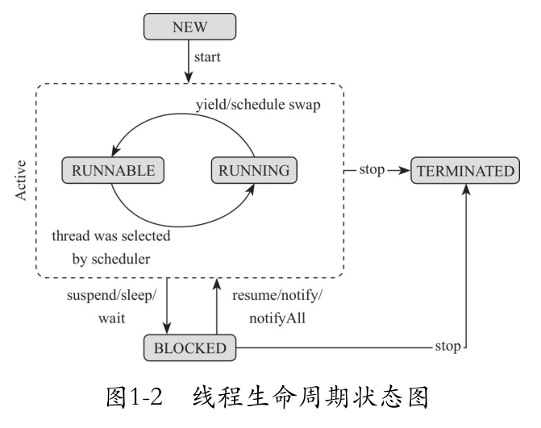
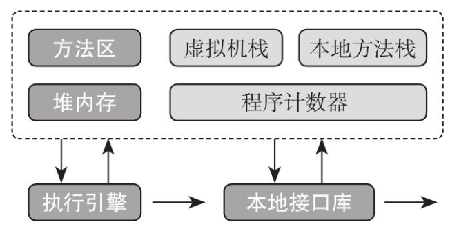
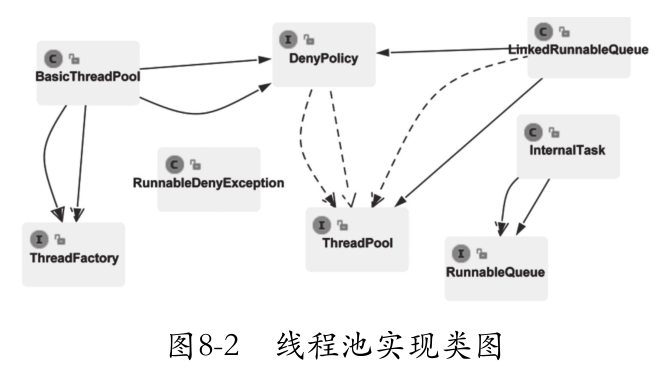
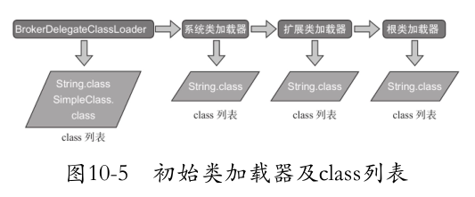
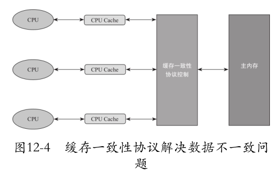
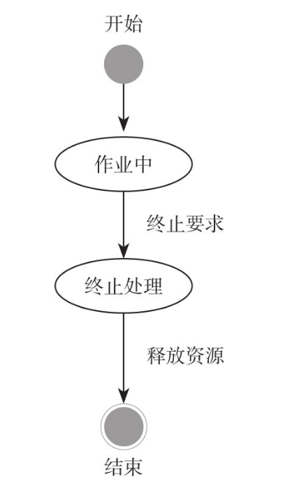
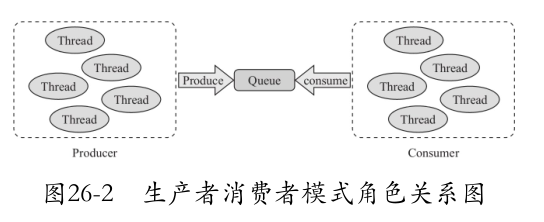
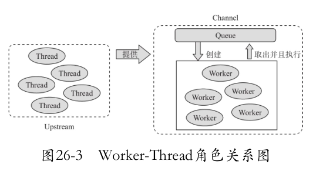
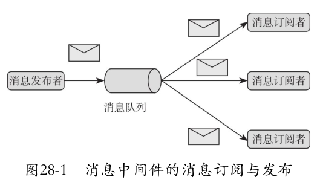

# JavaMutiThreadLearn


# 1 线程生命周期



1. new 创建线程对象
2. Runable 线程.start() 方法
3. Running -> blocked 使用了wait\sleep\interupt\io\lock
4. Blocked-> runable
5. terminated

线程结束后再次运行也会出现错误，线程只能单次运行

所有线程都具有一个父线程

# 2 线程组

ThreadGroup 

thread.getThreadGroup().getName() 获取线程组的名称，默认情况下与父线程一个组，同时与父线程有着相同的等级

## 2.1 JVM内存分配



1. 程序计数器线程私有
2. JAVA虚拟机栈线程私有，栈帧存放变量、动态链接、方法出口，通过-xss调整栈帧大小
3. 本地方法 C/C++
4. 堆内存所有线程共享，运行时对象全部放置于此
5. 方法区，多个线程共享区域

创建线程数量=（单个进程的最大内存数量-堆内存-系统内存）/ XSS

## 2.2 守护线程

程序如果没有守护线程就会退出 

```java
// 设置为守护线程
th.setDaemon(true);
// 守护线程跟随主线程结束一起结束
// java没有一个存在的守护线程那么就会退出
// 守护线程用于执行后台任务，当后台任务退出那么线程自动退出
```

# 3 THREAD API

系统休眠不会放弃monitor锁的所有权

```java
// TimeUnit定义休眠时间
TimeUnit.SECONDS.sleep(10);
TimeUnit.MINUTES.sleep(10);
TimeUnit.HOURS.sleep(10);
TimeUnit.MILLISECONDS.sleep(10);
```

## 3.1 yield

提醒调度器自愿放弃CPU资源，启发式算法 RUNING->RUNABLE

JAVA 1.5前使用 sleep(0) 代替yield

|      | sleep            | yield          |
| ---- | ---------------- | -------------- |
| 1    | 线程block        | 线程上下文切换 |
| 2    | 100%定时休眠     | 不一定         |
| 3    | 可以捕获中断信号 | 没有中断       |

1. setPriority()设置优先级，优先级小于等于组的最大优先级，默认与父类保持一致

2. interrupt线程进入堵塞（wait,sleep,join,InterruptibleChannel,wakeup）

3. join()等待线程执行完，在执行主线程，join线程执行完成后，在调用join没有反应

4. deprecated中断线程
5. volatile并发包的关键字

# 4 线程安全

## 4.1 synchronized

**1. synchronized 关键字对代码块或者是方法进行修饰，不能对变量类进行修饰**

**2. 使用synchronized 其monitor关联的对象不能为空**

**3. synchronized 作用域太大**

**4. 不同的monitor对象锁不同的方法**

**5. 多个锁交叉导致死锁**

**6. 同一个类的两个synchronized方法会锁住同一个对象，锁住的是CLASS对象自己**

```java
class testMonitor {
    public static void main(String[] args) {
        testMonitor testMonitor = new testMonitor();
        new Thread(testMonitor::func1, "10 ").start();
        new Thread(testMonitor::func2, "1 ").start();
    }

    public synchronized void func1() {
        for (int i = 0; i < 100; i++) {
            try {
                System.out.println(Thread.currentThread().getName() + i);
                TimeUnit.SECONDS.sleep(1);
            } catch (InterruptedException e) {
                e.printStackTrace();
            }
        }

    }

    public synchronized void func2() {
        for (int i = 0; i < 100; i++) {
            try {
                System.out.println(Thread.currentThread().getName() + i);
                TimeUnit.SECONDS.sleep(1);
            } catch (InterruptedException e) {
                e.printStackTrace();
            }
        }
    }
}
```

**static方法锁住的是CLASS本身**

```JAVA
class testMonitor {
    public static void main(String[] args) {
        testMonitor testMonitors = new testMonitor();
        new Thread(testMonitor::method1, "10 ").start();
        new Thread(testMonitor::method2, "1 ").start();
    }

    public static synchronized void method1(){
        System.out.println(Thread.currentThread().getName());
        try {
            TimeUnit.SECONDS.sleep(10);
        } catch (InterruptedException e) {
            throw new RuntimeException(e);
        }
    }

    public static void method2(){
        synchronized (testMonitor.class){
            System.out.println(Thread.currentThread().getName());
            try {
                TimeUnit.SECONDS.sleep(10);
            } catch (InterruptedException e) {
                throw new RuntimeException(e);
            }
        }
    }
}
```

## 4.2 死锁

1. 交叉锁
2. 内存不足
3. 一问一答错过中间过
4. 数据库锁住
5. 文件锁
6. 死循环

# 5 进程间通讯

阻塞分为同步阻塞以及异步阻塞，异步阻塞稳定性高

进程间通讯方式 wait和notify

```java
object.wait=oject.wait(0);
wait(0); //永不超时
notity,notifyAll; //唤醒
// 可以使用Interrupted将wait的线程打断
// notifyAll所有wait set中的线程全部都被弹出
```

## 5.1 生产者消费者模式

```java
class eventQueue {
    private final int max;
    private final static int defaultMax = 10;

    static class Event {

    }

    private final LinkedList<Event> eventQueueL = new LinkedList<>();

    public eventQueue() {
        this(defaultMax);
    }

    public eventQueue(int max) {
        this.max = max;
    }

    public void offer(Event event) {
        synchronized (eventQueueL) {
            if (eventQueueL.size() >= max) {
                try {
                    System.out.println("queue is full");
                    eventQueueL.wait();
                } catch (InterruptedException e) {
                    e.printStackTrace();
                }
            }
            System.out.println("submit new event");
            eventQueueL.addLast(event);
            eventQueueL.notifyAll();
        }
    }

    public Event take() {
        synchronized (eventQueueL) {
            while (eventQueueL.isEmpty()) {
                System.out.println("empty");
                try {
                    eventQueueL.wait();
                } catch (InterruptedException e) {
                    e.printStackTrace();
                }
            }
            Event event = eventQueueL.removeFirst();
            eventQueueL.notifyAll();
            System.out.println("taken event" + event);
            return event;
        }
    }
}
```

## 5.2 自定义锁

synchronized无法自定义时间同时阻塞无法被中断，syn无法捕获中断信号

```java
package BooleanLock;

import java.util.ArrayList;
import java.util.Collections;
import java.util.List;
import java.util.Optional;
import java.util.concurrent.TimeoutException;

import static java.lang.System.currentTimeMillis;

public class BooleanLock implements Lock{

    //当前拥有锁的线程
    private Thread currentThread;
    //当前锁没有任何线程获取或者释放
    private boolean locked=false;
    //哪些线程在获取当前线程时进入堵塞状态
    private final List<Thread> blockedList=new ArrayList<>();

    @Override
    public void lock() throws InterruptedException {
        synchronized (this){
            while(locked){
                final Thread tempThread=Thread.currentThread();
                try{
                    if(!blockedList.contains(tempThread)){
                        blockedList.add(tempThread);
                    }
                    this.wait();
                }catch (InterruptedException e){
                    blockedList.remove(tempThread);
                    throw e;
                }
            }
            blockedList.remove(Thread.currentThread());
            this.locked=true;
            this.currentThread=Thread.currentThread();
        }
    }

    @Override
    public void lock(long milliseconds) throws InterruptedException, TimeoutException {
        if(milliseconds<0){
            lock();
        }
        else{
            long remainingMills=milliseconds;
            long endMillSec=currentTimeMillis()+remainingMills;
            while(locked){
                if (remainingMills<=0) {
                    throw new TimeoutException("当前线程等待超时"+milliseconds+"ms"+Thread.currentThread().getName());
                }
                if(!blockedList.contains(Thread.currentThread())){
                    blockedList.add(Thread.currentThread());
                }
                this.wait(remainingMills);
                remainingMills=endMillSec-currentTimeMillis();
            }
            blockedList.remove(Thread.currentThread());
            this.locked=true;
            this.currentThread=Thread.currentThread();
        }
    }

    @Override
    public void tryLock() {
        if(!locked){
            this.locked=true;
            this.currentThread=Thread.currentThread();
        }
    }

    /**
     * 只有加锁的线程才有资格解锁
     */
    @Override
    public void unlock() {
        synchronized (this){
            if(this.currentThread==Thread.currentThread()){
                this.locked=false;
                Optional.of(currentThread.getName()+" release the lock").ifPresent(System.out::println);
                this.notifyAll();
            }
        }
    }

    @Override
    public List<Thread> getBlockedThread() {
        return Collections.unmodifiableList(blockedList);
    }
}
```

# 6 线程组

## 6.1 复制Thread与ThreadGroup

```java
class th {
    public static void main(String[] args) throws InterruptedException {
        ThreadGroup sp = new ThreadGroup(Thread.currentThread().getThreadGroup(), "");
        Thread th = new Thread(sp, new Runnable() {
            @Override
            public void run() {
                try {
                    TimeUnit.SECONDS.sleep(100);
                } catch (InterruptedException e) {
                    throw new RuntimeException(e);
                }
            }
        }, "Mth");
        th.start();
        TimeUnit.SECONDS.sleep(2);
        ThreadGroup sp2 = new ThreadGroup(sp, "");
        Thread[] ts = new Thread[10];
        final int enumerate = sp.enumerate(ts, true);
        System.out.println(enumerate);
        System.out.println(Arrays.toString(ts));
        sp.list();
        System.out.println(sp.parentOf(sp));
        //设置守护线程组用于后台多任务,主线程的线程组全部退出，同时退出，没有活跃线程自动退出
        Thread.currentThread().getThreadGroup().setDaemon(true);
        //没有活跃线程的线程组被销毁
        Thread.currentThread().getThreadGroup().destroy();
        //递归打断所有线程
        Thread.currentThread().getThreadGroup().interrupt();
    }
}

```

recurse设置是否递归复制

# 7 异常回调HOOK钩子

```java
class th2 {
    public static void main(String[] args) {
        // 设置异常处理方式
        Thread.setDefaultUncaughtExceptionHandler(new Thread.UncaughtExceptionHandler() {
            @Override
            public void uncaughtException(Thread t, Throwable e) {
                System.out.println(t.getName());
                e.printStackTrace();
            }
        });
        final Thread thread = new Thread(new Runnable() {
            @Override
            public void run() {
                try {
                    TimeUnit.SECONDS.sleep(2);
                } catch (InterruptedException e) {

                }
                System.out.println(1 / 0);
            }
        });
        thread.start();
    }
}
```

异常处理，如果设置了异常处理那么则采用异常处理，如果没有设置那么采用ThreadGroup中的方法具体实现,如果有父亲线程组则采用父线程组，未设置一般直接传递给SYSTEM.ERR

```java
public void uncaughtException(Thread t, Throwable e) {
    if (parent != null) {
        parent.uncaughtException(t, e);
    } else {
        Thread.UncaughtExceptionHandler ueh =
            Thread.getDefaultUncaughtExceptionHandler();
        if (ueh != null) {
            ueh.uncaughtException(t, e);
        } else if (!(e instanceof ThreadDeath)) {
            System.err.print("Exception in thread \""
                             + t.getName() + "\" ");
            e.printStackTrace(System.err);
        }
    }
}
```

## 7.1 HOOK线程

JVM退出的时候执行HOOK线程，JVM进程中没有非守护的活跃线程

```java
public static void main(String[] args) {
    // 可以注册多个钩子
    Runtime.getRuntime().addShutdownHook(new Thread(new Runnable() {
        @Override
        public void run() {
            System.out.println("bye");
        }
    }));
    // 可以注册多个钩子
    Runtime.getRuntime().addShutdownHook(new Thread(new Runnable() {
        @Override
        public void run() {
            System.out.println("bye2");
        }
    }));
}
```

## 7.2 HOOK程序启动管理

```java
import java.io.IOException;
import java.nio.file.Files;
import java.nio.file.Path;
import java.nio.file.Paths;
import java.nio.file.attribute.PosixFilePermission;
import java.nio.file.attribute.PosixFilePermissions;
import java.util.Set;
import java.util.concurrent.TimeUnit;

public class HookFile {
    private final static String lock_path="/home/qxc/locks/";
    private final static String name=".lock";
    private final static String permission="rw-------";

    public static void main(String[] args) throws IOException {
        Runtime.getRuntime().addShutdownHook(new Thread(()->{
            System.out.println("The Program received kill SIGNAL");
            getLockFile().toFile().delete();
        }));
        checking();
        for(;;){
            try{
                TimeUnit.SECONDS.sleep(1);
                System.out.println("Program is Running");
            } catch (InterruptedException e) {
                e.printStackTrace();
            }
        }
    }

    public static void checking() throws IOException {
        Path path=getLockFile();
        if(path.toFile().exists()){
            throw new RuntimeException("Program already running");
        }
        Set<PosixFilePermission> permissions= PosixFilePermissions.fromString(permission);
        Files.createFile(path,PosixFilePermissions.asFileAttribute(permissions));
    }

    private static Path getLockFile(){
        return Paths.get(lock_path,name);
    }
}
```

kill -9 不会执行，因为收不到退出信号

HOOK可以用于执行关闭文件句柄、socket断开连接、数据库链接断开

**本章介绍了如何通过Handler回调的方式获取线程运行期间的异常信息，并且分析了Thread的源码从追踪uncaughtException的执行顺序；Hook线程是一个非常好的机制，可以帮助程序获得进程中断信号，有机会在进程退出之前做一些资源释放的动作，或者做一些告警通知。切记如果强制杀死进程，那么进程将不会收到任何中断信号。**

# 8 JAVA实现线程池



拒绝策略

```java
package ThreadPool;

public interface DenyPolice {
    void reject(Runnable runnable,ThreadPool threadPool);

    /**
     * 该策略将任务抛弃
     */
    class DiscardDenyPolice implements DenyPolice{
        @Override
        public void reject(Runnable runnable, ThreadPool threadPool) {

        }
    }

    /**
     * 该策略将任务抛出异常
     */
    class AbortDenyPolice implements DenyPolice{
        @Override
        public void reject(Runnable runnable, ThreadPool threadPool) {
            throw new RunnableDenyException(runnable+" will be abort");
        }
    }

    /**
     * 该策略是任务在提交者所在线程中执行
     */
    class RunnerDenyPolice implements DenyPolice{
        @Override
        public void reject(Runnable runnable, ThreadPool threadPool) {
            if (!threadPool.isShutDown()){
                runnable.run();
            }
        }
    }
}
```

执行程序队列

```java
package ThreadPool;

public interface RunnableQueue {
    /**
     * 添加新任务
     * @param runnable
     */
    void offer(Runnable runnable);

    /**
     * 工作线程通过take方法获取Runnable
     * @return
     */
    Runnable take() throws InterruptedException;

    /**
     * 获取任务队列中任务数量
     * @return
     */
    int size();

}
```

线程工厂

```java
package ThreadPool;


/**
 * 创建线程的接口，个性化定制Thread
 */
@FunctionalInterface
public interface ThreadFactory {
    /**
     * 创建线程
     * @param runnable
     * @return
     */
    Thread createThread(Runnable runnable);
}
```

```java
package ThreadPool;

/**
 * 线程池接口
 */
public interface ThreadPool {
    /**
     * 向线程池提交任务
     * @param runnable
     */
    void execute(Runnable runnable);

    /**
     * 关闭线程池
     */
    void shutdown();

    /**
     * 获取线程池初始大小
     * @return
     */
    Integer getInitSize();

    /**
     * 获取线程池的最大数量
     * @return
     */
    Integer getMaxSize();

    /**
     * 获取当前线程池核心线程数量大小
     * @return
     */
    Integer getCoreSize();

    /**
     * 获取线程池中用于缓存任务队列的大小
     * @return
     */
    Integer getQueueSize();

    /**
     * 获取线程池中活动线程的数量
     * @return
     */
    Integer getActiveCount();

    /**
     * 线程池是否关闭
     * @return
     */
    boolean isShutDown();
}
```

线程池

```java
package ThreadPool;

import java.util.ArrayDeque;
import java.util.Queue;
import java.util.concurrent.TimeUnit;
import java.util.concurrent.atomic.AtomicInteger;

/**
 * 线程池初始化
 */
public class BasicThreadPool extends Thread implements ThreadPool{
    //初始化大小
    private final int initSize;
    //最大大小
    private final int maxSize;
    //核心线程大小
    private final int coreSize;
    //当前活跃线程大小
    private int activeSize;
    //线程工厂
    private final ThreadFactory threadFactory;
    //任务队列
    private final RunnableQueue runnableQueue;
    //线程池是否被shutdown
    private volatile boolean shutdown=false;
    //工作线程队列
    private final Queue<ThreadTask> threadQueue=new ArrayDeque<>();
    //默认线程满策略
    private final static DenyPolice DENY_POLICE=new DenyPolice.DiscardDenyPolice();
    //默认线程工厂
    private final static ThreadFactory defaultThreadFactory=new DefaultThreadFactory();

    private final TimeUnit timeUnit;
    //更新时间
    private final long keepAlive;

    public BasicThreadPool(int initSize,int maxSize,int coreSize,int queueSize){
        this(initSize,maxSize,coreSize,queueSize,defaultThreadFactory,DENY_POLICE,TimeUnit.SECONDS,5);
    }

    public BasicThreadPool(int initSize, int maxSize, int coreSize, int queueSize, ThreadFactory threadFactory,
                           DenyPolice denyPolice, TimeUnit timeUnit,long keepAlive){
        this.initSize=initSize;
        this.maxSize=maxSize;
        this.coreSize=coreSize;
        this.threadFactory=threadFactory;
        this.runnableQueue=new LinkedRunnableQueue(queueSize,denyPolice,this);
        this.timeUnit=timeUnit;
        this.keepAlive=keepAlive;
        this.init();
    }

    private void init(){
        start();
        for (int i = 0; i <initSize; i++) {
            newThread();
        }
    }

    private void newThread(){
        //创建线程启动任务
        InternalTask internalTask=new InternalTask(runnableQueue);
        Thread thread=this.threadFactory.createThread(internalTask);
        ThreadTask threadTask=new ThreadTask(thread,internalTask);
        threadQueue.offer(threadTask);
        this.activeSize++;
        thread.start();
    }

    /**
     * 关闭一个线程
     * @return
     */
    private void removeThread(){
        ThreadTask threadTask=threadQueue.remove();
        threadTask.internalTask.stop();
        this.activeSize--;
    }

    /**
     * 维护线程池操作
     */
    @Override
    public void run() {
        while(!shutdown&&!isInterrupted()){
            try {
                timeUnit.sleep(keepAlive);
            } catch (InterruptedException e) {
                shutdown=true;
                break;
            }
            synchronized (this){
                if(shutdown){
                    break;
                }
                //当前队列尚有任务没有处理，并且 则继续扩容
                if(runnableQueue.size()>0&&activeSize<coreSize){
                    for (int i = initSize; i < coreSize; i++) {
                        newThread();
                    }
                    //不让线程扩容直接达到maxsize
                    continue;
                }
                //如果队列中有任务没有处理，并且 则继续扩容到maxsize
                if(runnableQueue.size()>0&&activeSize<maxSize){
                    for (int i = initSize; i < coreSize; i++) {
                        newThread();
                    }
                }
                //如果队列中没有任务则回收到coreSize
                if(runnableQueue.size()==0&&activeSize>coreSize){
                    for (int i = coreSize; i < activeSize; i++) {
                        removeThread();
                    }
                }
            }
        }
    }

    @Override
    public void execute(Runnable runnable) {
        if(this.shutdown){
            throw new IllegalStateException("This thread pool is shutdown");
        }
        this.runnableQueue.offer(runnable);
    }

    @Override
    public void shutdown() {
        synchronized (this){
            if(shutdown) {
                return;
            }
            shutdown=true;
            threadQueue.forEach(threadTask -> {
                threadTask.internalTask.stop();
                threadTask.thread.interrupt();
            });
        }
    }

    @Override
    public Integer getInitSize() {
        if(this.shutdown){
            throw new IllegalStateException("This thread pool is shutdown");
        }
        return initSize;
    }

    @Override
    public Integer getMaxSize() {
        if(this.shutdown){
            throw new IllegalStateException("This thread pool is shutdown");
        }
        return maxSize;
    }

    @Override
    public Integer getCoreSize() {
        if(this.shutdown){
            throw new IllegalStateException("This thread pool is shutdown");
        }
        return coreSize;
    }

    @Override
    public Integer getQueueSize() {
        if(this.shutdown){
            throw new IllegalStateException("This thread pool is shutdown");
        }
        return runnableQueue.size();
    }

    @Override
    public Integer getActiveCount() {
        if(this.shutdown){
            throw new IllegalStateException("This thread pool is shutdown");
        }
        return activeSize;
    }

    @Override
    public boolean isShutDown() {
        return shutdown;
    }

    /**
     * 默认的线程工厂
     */
    private static class DefaultThreadFactory implements ThreadFactory {
        private static final AtomicInteger GROUP_COUNTER=new AtomicInteger(1);
        private static final ThreadGroup group=new ThreadGroup("ThreadPool-"+GROUP_COUNTER.getAndIncrement());
        private static final AtomicInteger COUNTER=new AtomicInteger(0);

        @Override
        public Thread createThread(Runnable runnable) {
            return new Thread(group,runnable,"thread-pool-"+COUNTER.getAndIncrement());
        }
    }

    /**
     * InternalTask 和 thread 的组合
     */
    private static class ThreadTask {
        public ThreadTask(Thread thread,InternalTask internalTask){
            this.thread=thread;
            this.internalTask=internalTask;
        }
        Thread thread;
        InternalTask internalTask;
    }
}
```

内部任务

```java
package ThreadPool;

/**
 * 执行线程池里面的方法
 */
public class InternalTask implements Runnable{
    private final RunnableQueue runnableQueue;
    private volatile boolean running=true;

    public InternalTask(RunnableQueue runnableQueue){
        this.runnableQueue=runnableQueue;
    }

    @Override
    public void run() {
        while (running&&!Thread.currentThread().isInterrupted()){
            Runnable task;
            try {
                task = runnableQueue.take();
                task.run();
            } catch (InterruptedException e) {
                e.printStackTrace();
            }
        }
    }

    public void stop(){
        this.running=false;
    }
}
```

实现队列

```java
package ThreadPool;

import java.util.LinkedList;

public class LinkedRunnableQueue implements RunnableQueue{
    //最大限度
    private final int limit;
    //若队列中的线程满了则需要执行拒绝策略
    private final DenyPolice denyPolice;
    //存放任务的队列
    private final LinkedList<Runnable> runnables=new LinkedList<>();
    private ThreadPool threadPool;

    /**
     * 初始化构造方法
     * @param limit 最大任务数量
     * @param denyPolice 拒绝策略
     * @param threadPool 线程池
     */
    public LinkedRunnableQueue(int limit,DenyPolice denyPolice,ThreadPool threadPool){
        this.limit=limit;
        this.denyPolice=denyPolice;
        this.threadPool=threadPool;
    }

    @Override
    public void offer(Runnable runnable) {
        synchronized (runnables){
            if(runnables.size()>=limit){
                //执行拒绝策略
                denyPolice.reject(runnable,threadPool);
            }else{
                //可以执行放入队列，唤醒所有等待线程
                runnables.addLast(runnable);
                runnables.notifyAll();
            }
        }
    }

    @Override
    public Runnable take() throws InterruptedException{
        synchronized (runnables){
            while (runnables.isEmpty()){
                try{
                    //如果其中没有线程进入等待
                    runnables.wait();
                } catch (InterruptedException e) {
                    throw e;
                }
            }
            return runnables.removeFirst();
        }
    }

    @Override
    public int size() {
        synchronized (runnables){
            return runnables.size();
        }
    }
}
```

```java
package ThreadPool;

public class RunnableDenyException extends RuntimeException {
    public RunnableDenyException(String s) {
        super(s);
    }
}
```

# 9 JAVA类加载

1. 子类初始化会导致父类的初始化
2. 使用反射也会导致类初始化
3. 访问类的静态变量初始化类
4. 启动类main函数所在的类
5. 随机函数也需要初始化

## 9.1 类的加载阶段

CLASS->Blob->静态结构->数据结构->生成对象

类动态生成/网络获取/读取WAR包/数据库Blob/运行时生成Thrift

**验证阶段**

1. 验证文件格式（魔术因子、主次版本号、MD5指纹、常量池是否满足要求、常量引用是否指向不存在的值、其他信息）
2. 元数据验证，检查类是否存在父类，检查是否继承final，检查类是否抽象类，检查重载的合法性，语义验证
3. 字节码验证，
4. 符号引用验证

**准备赋值**

**进行加载**

# 10 类加载器 ClassLoader

## 10.1 三大类加载器

1. 根加载器先加载 "jre1.8.0_321\lib\rt.jar"
2. 扩展类加载器：加载 JRE/LB/EXT内部的类库 “C:\Program Files (x86)\Java\jre1.8.0_321\lib\ext\\\*.jar”
3. 系统类加载器 加载classpath路径下的包

## 10.2 自定义类加载器

自定义类加载器

```java
package ClassLoaders;

import java.io.ByteArrayOutputStream;
import java.io.IOException;
import java.nio.file.Files;import java.nio.file.Path;
import java.nio.file.Paths;

public class classLoaders extends ClassLoader{
    private final static Path Default_CLASS_DIR= Paths.get("D:","JAVA/Th/Class/");

    private final Path classDir;

    /**
    * 默认的class路径
    */
    public classLoaders(){
        super();
        this.classDir=Default_CLASS_DIR;
    }

    public classLoaders(String classDir){
        super();
        this.classDir=Paths.get(classDir);
    }

    /**
     * 指定路径同时指定父类加载器
     * @param classDir
     * @param classLoader
     */
    public classLoaders(String classDir,ClassLoader classLoader){
        super(classLoader);
        this.classDir=Paths.get(classDir);
    }

    /**
     * 重写findClass方法
     */
    @Override
    protected Class<?> findClass(String name) throws ClassNotFoundException {
        byte[] classByte=this.readClassBytes(name);
        if(classByte.length == 0){
            throw new ClassNotFoundException("can not load this class");
        }
        // 调用define方法定义class
        return this.defineClass(name,classByte,0, classByte.length);
    }

    /**
     * 将class文件读取到内存
     * @param name
     * @return
     * @throws ClassNotFoundException
     */
    private byte[] readClassBytes(String name) throws ClassNotFoundException{
        String path=name.replace(".","/");
        Path classFullPath=classDir.resolve(Paths.get(path+".class"));
        if(!classFullPath.toFile().exists()){
            throw new ClassNotFoundException("no such class "+name+" in "+classFullPath);
        }
        ByteArrayOutputStream b=new ByteArrayOutputStream();
        try {
            Files.copy(classFullPath,b);
            return b.toByteArray();
        } catch (IOException e) {
            e.printStackTrace();
            throw new ClassNotFoundException("load "+classFullPath+" occur error!!");
        }
    }

    @Override
    public String toString() {
        return "classLoaders{" +
                "classDir=" + classDir +
                '}';
    }
}
```

**双亲继承机制 首先是自定义加载器-系统类加载器-扩展类加载器-跟类加载器 想要绕过其中的系统类加载器 需要将其父类加载器设置为NULL 或者将自定义类加载器的父加载器设置为扩展类加载器**

> 类加载的步骤如下
>
> 1. 首先查看是否已经被加载
> 2. 查看是否有父类加载器
> 3. 没有父类加载器则使用根加载器
> 4. 还没有找到则查询当前类的类加载器
> 5. 成功则再次进行性能统计
> 6. 默认不进行连接操作

**类加载器的实现**

```java
package ClassLoaders;

/**
 * 继承原有自定义类加载器，更新破坏双清委托机制
 */
public class ClassLoaderPlus extends classLoaders{
    public ClassLoaderPlus(String s) {
        super(s);
    }

    public ClassLoaderPlus(){

    }

    @Override
    public Class<?> loadClass(String name,boolean resolve) throws ClassNotFoundException {
        synchronized (getClassLoadingLock(name)){
            //如果已经加载则直接返回
            Class<?> klass=findLoadedClass(name);
            if(klass==null){
                //如果是系统类则调用系统类加载器
                if(name.startsWith("java")||name.startsWith("javax")) {
                    try{
                        klass=getSystemClassLoader().loadClass(name);
                    }catch(Exception ignored){

                    }
                }else{
                    //如果不是系统类则使用自定义类加载器进行加载
                    try{
                        klass=this.findClass(name);
                    }catch (ClassNotFoundException ignored){

                    }
                    if(klass==null){
                        //调用其父类加载器进行加载
                        if(getParent()!=null){
                            klass=getParent().loadClass(name);
                        }else{
                            //父类加载器无法加载则调用系统加载器加载
                            klass=getSystemClassLoader().loadClass(name);
                        }
                    }
                }
            }
            //多次加载还未完成则无法加载
            if (klass==null) {
                throw new ClassNotFoundException("no such class "+name);
            }
            if(resolve){
                resolveClass(klass);
            }
            return klass;
        }
    }
}
```

**如何破坏委托机制 目的实现热部署**

```java
// 设置新对象的类加载器的父加载器是新创建的加载器
public static void test() throws ClassNotFoundException, NoSuchMethodException, InvocationTargetException, IllegalAccessException, InstantiationException {
    ClassLoader ls=classLoaders.class.getClassLoader();
    classLoaders cld=new classLoaders("D:/JAVA/Th/Class/",ls);
    Class<?> clz=cld.loadClass("ClassLoaders.helloworld");
    System.out.println(clz.getClassLoader());

    Object helloWorld=clz.getDeclaredConstructor().newInstance();
    System.out.println(helloWorld);

    Method method=clz.getMethod("welcome");
    String str= (String) method.invoke(helloWorld);
    System.out.println(str);
}
// 设置新对象的类加载器为null
classLoaders cld=new classLoaders("D:/JAVA/Th/Class/",null);
```

**不同类加载器加载同一个class**



```java
class Test2 {
    /**
     * 不同的类加载器加载同一个路径得到的是不同对象
     * 相同的类加载器同一个路径得到的是不同对象
     * 不同运行时包不可以相互访问
     * @param args
     * @throws ClassNotFoundException
     */
    public static void main(String[] args) throws ClassNotFoundException {
        ClassLoader ls = classLoaders.class.getClassLoader();
        classLoaders cld = new classLoaders("D:/JAVA/Th/Class/");
        Class<?> clz = cld.loadClass("ClassLoaders.helloworld");

        ClassLoader ls2 = classLoaders.class.getClassLoader();
        classLoaders cld2 = new classLoaders("D:/JAVA/Th/Class/");
        Class<?> clz3 = cld2.loadClass("ClassLoaders.helloworld");

        System.out.println(clz);
        System.out.println(clz3);
        System.out.println(clz==clz3);
    }
}
```

## 10.2 类何时回收

1. 加载类的ClassLoader实例被回收
2. 所有实例被GC
3. 该类的class没有在其他地方被应用

# 11 线程上下文类加载器

线程上下文方法 

获取 getContextClassLoader()

设置 setContextClassLoader(ClassLoader)

## 11.1 为什么要有Thread ContextClassLoader

​	Java中的类加载机制是双亲委派模型，即按照AppClassLoader → SystemClassLoader → BootstrapClassLoader 的顺序，子ClassLoader将一个类加载的任务委托给父ClassLoader（父ClassLoader会再委托给父的父ClassLoader）来完成，只有父ClassLoader无法完成该类的加载时，子ClassLoader才会尝试自己去加载该类。所以越基础的类由越上层的ClassLoader进行加载，但如果基础类又要调用回用户的代码，那该怎么办？

​	**为了解决这个问题，Java设计团队只好引入了一个不太优雅的设计：Thread ContextClassLoader（线程上下文类加载器）。这个ClassLoader可以通过 `java.lang.Thread`类的`setContextClassLoaser()`方法进行设置；如果创建线程时没有设置，则它会从父线程中继承（见以下`Thread`的源码）；如果在应用程序的全局范围内都没有设置过的话，那这个类加载器默认为AppClassLoader**。

 	由于JDK定义了SPI的标准接口，加之这些接口被作为JDK核心标准类库的一部分，既想完全透明标准接口的实现，又想与JDK核心库进行捆绑，由于JVM类加载器双亲委托机制的限制，启动类加载器不可能加载得到第三方厂商提供的具体实现。为了解决这个困境，JDK只好提供一种不太优雅的设计——线程上下文类加载器，有了线程上文类加载器，启动类加载器（根加载器）反倒需要委托子类加载器去加载厂商提供的SPI具体实现。

```java
/**
 * 对于任意的类加载器实例其不会多次加载同一个类一个类只能加载一次
 * 不同的类加载器可以加载多个
 * 不同累计在其加载同一个类生成两个实例
 * 相同类加载器加载同一个class则两个对象
 * 相同类加载器的不同实例可以加载同一个类分别得到不同的实例
 */
class namespaceTest {
    public static void main(String[] args) {
        ClassLoader ls = namespaceTest.class.getClassLoader();
        System.out.println(ls);
        Class<?> a = null;
        try {
            a = ls.loadClass(namespaceTest.class.getCanonicalName());
        } catch (ClassNotFoundException e) {
            e.printStackTrace();
        }
        Class<?> b = null;
        ClassLoaderPlus cls = new ClassLoaderPlus("");
        try {
            b = cls.loadClass(namespaceTest.class.getCanonicalName(), false);
        } catch (ClassNotFoundException e) {
            e.printStackTrace();
        }
        ClassLoader l = ClassLoader.getSystemClassLoader();
        Class<?> c = null;
        try {
            c = l.loadClass(namespaceTest.class.getCanonicalName());
        } catch (ClassNotFoundException e) {
            e.printStackTrace();
        }
        System.out.println(a.hashCode());
        System.out.println(b.hashCode());
        System.out.println(c.hashCode());
        System.out.println(a == b);
        System.out.println(c == b);
    }
}
```

# 12 VOLATILE关键字

> CPU如何保证缓存一致性

1. 总线加锁 悲观方式

2. 缓存一致性

   

## 12.1 Java内存模型

1. 共享变量存储于主内存之中，每个线程都可以访问
2. 每个线程都有私有工作内存或者本地内存
3. 工作内存只存储线程对共享变量的副本
4. 线程只能先操作工作内存在写入主线程
5. 工作内存和java内存模型一样是抽象概念

# 13 VOLATILE关键字的作用

并发编程3个特性：**原子性、可见性、有序性**

三个原子性操作进行组合不一定是原子性操作

可见性是指一个线程更改共享变量其他线程是否可以看到

指令重排导致执行顺序发生变化

**JAVA的内存模型的机制来屏蔽各个平台和操作系统之间内存访问的差异**

```java
// 原子性操作
int x=10;
// 非原子操作 先要读取y的值再去修改x的值 最后放入主内存当中
int x=y;
// 非原子操作 读取y值 y+1 写入内存
x++;
// 非原子
z=z+1;
```

**JAVA使用volatile、synchronized、显式锁Lock保证有序性**

1. 常用于开关控制
2. 状态标记利用顺序性特点
3. double-check利用顺序性特点

## 13.1 volatile和synchronized区别

|            | volatile                               | synchronized   |
| :--------- | :------------------------------------- | :------------- |
| 使用       | 修饰实例变量或者类变量，对象不能为null | 对象可以为null |
| 原子性保证 | 可以保证                               | 无法保证       |
| 可见性保证 | 借助JVM指令，排他方式                  | 使用lock       |
| 有序性保证 | 可以重新排序                           | 不重新排序     |
| 其他       | 其他线程非阻塞                         | 线程阻塞       |

# 14 7种单例设计模式的设计

## 14.1 饿汉模式

```java
// 不能懒加载，cinit()过程中直接生成实例，保证了单一性
final class Hungary{
    private Integer num=0;
    private static final Hungary instance=new Hungary();
    private Hungary(){}
    public static Hungary getInstance(){
        return instance;
    }
    public synchronized void Inc(){
        num++;
    }
    public void getNum(){
        System.out.println(num);
    }
}
```

## 14.2 懒汉模式+同步方法

```java
// 获取变量的过程种在进行加载 但是instance不能保证唯一性，因此增加synchronized关键字
final class Lazy{
    private Integer num=0;
    private static Lazy instance=null;
    private Lazy(){}

    public synchronized static Lazy getInstance(){
        if(instance!=null){
            return instance;
        }else{
            instance=new Lazy();
            return instance;
        }
    }

    public synchronized void Inc(){
        num++;
    }

    public void getNum(){
        System.out.println(num);
    }
}
```

## 14.3 Double-Check-Volatile

```java
// 只在初始化过程中进行同步，但是有可能并没有全部加载完成，导致其中存在null的对象,因此对instance对象
// 增加关键字volatile拒绝重新排序
final class DoubleCheck{
    ClassLoader cls;
    Socket socket;
    private Integer num=0;
    private volatile static DoubleCheck instance=null;

    private DoubleCheck(){
        this.cls=new ClassLoaderPlus();
        this.socket=new Socket();
    }

    public static DoubleCheck getInstance(){
        if(instance==null){
            synchronized (DoubleCheck.class){
                if (instance==null) {
                    instance=new DoubleCheck();
                }
            }
        }
        return instance;
    }
    public synchronized void Inc(){
        num++;
    }
    public void getNum(){
        System.out.println(num);
    }
}
```

## 14.4 Holder

```java
// 使用最为广泛，但是只能通过Java GC自动销毁
final class Holder{
    private Holder(){}
    private Integer num=0;
    private static class holder {
        private final static Holder instance=new Holder();
    }

    public static Holder getInstance(){
        return holder.instance;
    }

    public synchronized void Inc(){
        num++;
    }

    public void getNum(){
        System.out.println(num);
    }
}
```

## 14.5 枚举方式

```java
// 懒汉枚举
final class LEnum{
    private Integer num=0;
    private LEnum(){

    }

    public synchronized void Inc() {
        num++;
    }

    public void getNum() {
        System.out.println(num);
    }

    private enum EnumHolder{
        INSTANCE;
        private LEnum instance;
        EnumHolder() {
            this.instance=new LEnum();
        }
        private LEnum getInstance(){
            return instance;
        }
    }

    public static LEnum getInstance(){
        return EnumHolder.INSTANCE.getInstance();
    }
}
```

# 15 监控任务的生命周期

**要监控任务的生命周期，那么需要创建一个线程类继承Thread，在运行时通过重载的RUN方法，对状态进行判断，包括等待、运行前、运行完成、运行出错**


> ​	首先Observable接口规定了线程开始和打断的方法，这两个方法都通过Thread类的start、 interrupt方法实现。 TaskLifCycle接口规定了在线程不同状态下的执行方法 Task 通过 call虚拟方法返回需要监控的线程返回值 EmptyLifCycle作为TaskLifCycle接口的一个虚拟的实现 ObservableThread是一个泛型类其接口返回的是值类型。这个类通过run方法获取到线程的执行状态 之后通过update方法执行相应的监控方法

1. **具体实现如下首先需要对任务线程进行包装具有执行接口，对于这个接口后续可以继续进行拓展**

```java
package observecycle;

/**
 * @author 邱星晨
 */
public interface Task<T> {
    /**
     * 任务执行接口，允许有返回值
     * @return
     */
    T call();
}
```

2. **实现四个阶段所需要实现的接口，还需要实现一个空类用于未分配的任务**

```java
package observecycle;

/**
 * @author 邱星晨
 */
public interface TaskLifeCycle<T> {
    /**
     * 开始
     * @param thread
     */
    void onStart(Thread thread);

    /**
     * 运行
     * @param thread
     */
    void onRunning(Thread thread);

    /**
     * 结束
     * @param thread
     * @param result
     */
    void onFinish(Thread thread,T result);

    /**
     * 错误
     * @param thread
     * @param e
     */
    void onError(Thread thread,Exception e);
}

/**
 * 生命周期接口空实现
 * @param <T>
 */
class EmptyLifeCycle<T> implements TaskLifeCycle<T>{

    @Override
    public void onStart(Thread thread) {

    }

    @Override
    public void onRunning(Thread thread) {

    }

    @Override
    public void onFinish(Thread thread, T result) {

    }

    @Override
    public void onError(Thread thread, Exception e) {

    }
}
```

3. **实现观察者的接口**

```java
package observecycle;

/**
 * @author 邱星晨
 */
public interface Observable {
    /**
     * 任务周期枚举类型
     */
    enum Cycle{
        //开始，运行中，结束，错误
        START,RUNNING,DONE,ERROR
    }

    /**
     * 获取当前的生命周期状态
     * @return
     */
    Cycle getCycle();

    /**
     * 开始
     */
    void start();

    /**
     * 打断
     */
    void interrupt();
}
```

4. **观察者类实现观察者接口以及继承线程类**

```java
package observecycle;

/**
 * @author 邱星晨
 */
public class ObservableThread<T> extends Thread implements Observable {

    private final TaskLifeCycle<T> lifeCycle;
    private final Task<T> task;
    private Cycle cycle;

    public ObservableThread(Task<T> task) {
        this(new EmptyLifeCycle<T>(), task);
    }

    public ObservableThread(TaskLifeCycle<T> tEmptyLifeCycle, Task<T> task) {
        super();
        if (task == null) {
            throw new NullPointerException("task can not be null");
        }
        this.lifeCycle = tEmptyLifeCycle;
        this.task = task;
    }

    @Override
    public final void run() {
        //执行开始thread.start
        this.update(Cycle.START, null, null);
        try {
            this.update(Cycle.RUNNING, null, null);
            T result = task.call();
            this.update(Cycle.DONE, result, null);
        } catch (Exception e) {
            this.update(Cycle.ERROR, null, e);
        }
    }

    private void update(Cycle cycle, T result, Exception e) {
        this.cycle = cycle;
        if (lifeCycle == null) {
            return;
        }
        try {
            switch (cycle) {
                case START:
                    this.lifeCycle.onStart(currentThread());
                    break;
                case RUNNING:
                    this.lifeCycle.onRunning(currentThread());
                    break;
                case DONE:
                    this.lifeCycle.onFinish(currentThread(), result);
                    break;
                case ERROR:
                    this.lifeCycle.onError(currentThread(), e);
                    break;
                default:
                    break;
            }
        } catch (Exception ex) {
            if (cycle == Cycle.DONE) {
                throw ex;
            }
        }
    }

    @Override
    public Cycle getCycle() {
        return this.cycle;
    }
    
    @Override
    public void interrupt() {
        super.interrupt();
    }
}
```

# 16 Single Thread Execution设计模式

把需要线程安全对象包装成为一个类，之后对类采用synchronized进行加锁

```java
package singlethreadexec;

import java.util.Arrays;

/**
 * @author 邱星晨
 * 应当在线程安全的情况下减少synchronized的作用域
 */
public class EatNoodles {
    /**
     * 模拟两个锁互斥互相解锁的情况
     */
    public static void main(String[] args) {
        TableWare tableWare1 = new TableWare("1");
        TableWare tableWare2 = new TableWare("2");
        Eatthread eatthread1 = new Eatthread(tableWare1, tableWare2);
        Eatthread eatthread2 = new Eatthread(tableWare2, tableWare1);
        eatthread1.start();
        eatthread2.start();
    }
}

class TableWare {
    private final String name;

    public TableWare(String str) {
        this.name = str;
    }

    @Override
    public String toString() {
        return "TableWare{" +
                "name='" + name + '\'' +
                '}';
    }
}

class Eatthread extends Thread {

    private TableWare left;
    private TableWare right;

    public Eatthread(TableWare left, TableWare right) {
        this.left = left;
        this.right = right;
    }

    @Override
    public void run() {
        while (true) {
            this.eat();
        }
    }

    private void eat() {
        synchronized (left) {
            System.out.println(left);
            synchronized (right) {
                System.out.println(right);
                System.out.println("eat");
                System.out.println(right);
            }
            System.out.println("eat");
        }
    }
}
```

# 17 读写锁分离

单线程写的过程中其他线程不允许有其他炒作，可以多线程同时读取

如何实现一个读写分离的锁：

1. 首先读写锁的对象是唯一的 MUTEX=new Object();
2. 其次设计时需要先考虑接口设计
3. 读写锁所需的接口包括 LOCK、READWRITE
4. 分别实现READLOCK、WRITELOCK

```java
// LOCK接口
public interface Lock {
    /**
     * 上锁 未获得锁的线程被堵塞
     * @throws InterruptedException
     */
    void lock() throws InterruptedException;

    /**
     * 解锁
     */
    void unLock();
}
```

```java
// READWRITE
package readwritelock;

/**
 * @author 邱星晨
 */
public interface ReadWriteLock {
    /**
     * 生成reader锁
     * @return
     */
    Lock readLock();

    /**
     * 创建write锁
     * @return
     */
    Lock writeLock();

    /**
     * 当前有多少线程在写入
     * @return
     */
    int getWritingWrites();

    /**
     * 当前有多少线程在等待写入
     * @return
     */
    int getWaitingWrites();

    /**
     * 当前多少线程在读取
     * @return
     */
    int getReadingReaders();

    /**
     * 创建readWriteLock
     * @return
     */
    static ReadWriteLock readWriteLock() {
        return new ReadWriteLockImpl();
    }

    /**
     * 工厂方法创建 readWriteLock 并且传入preferWrite
     * @param preferWrite
     * @return
     */
    static ReadWriteLock readWriteLock(boolean preferWrite){
        return new ReadWriteLockImpl(preferWrite);
    }
}

```

```java
// ReadWriteLockImpl实现ReadWriteLock，偏向锁
package readwritelock;

/**
 * @author 邱星晨
 */
class ReadWriteLockImpl implements ReadWriteLock {
    /**
     * 定义对象锁
     */
    private final Object MUTEX=new Object();
    /**
     * 写入线程数量
     */
    private int writingWrites=0;
    /**
     * 等待写入锁的线程数量
     */
    private int writingWaits=0;
    /**
     * 读取的线程数量
     */
    private int readingReaders=0;
    /**
     * 是否是写偏向锁
     */
    private boolean preferWrite;
    
    public ReadWriteLockImpl() {
        this(true);
    }
    
    public ReadWriteLockImpl(boolean preferWrite) {
        this.preferWrite=preferWrite;
    }
    
    @Override
    public Lock readLock() {
        return new ReadLock(this);
    }

    @Override
    public Lock writeLock() {
        return new WriteLock(this);
    }

    @Override
    public int getWritingWrites() {
        return writingWrites;
    }

    @Override
    public int getWaitingWrites() {
        return writingWaits;
    }

    @Override
    public int getReadingReaders() {
        return readingReaders;
    }
    
    public void writesIncrease(){
        this.writingWrites++;
    }
    
    public void waitsIncrease(){
        this.writingWaits++;
    }
    
    public void readsIncrease(){
        this.readingReaders++;
    }

    public void writesDecrease(){
        this.writingWrites--;
    }

    public void waitsDecrease(){
        this.writingWaits--;
    }

    public void readsDecrease(){
        this.readingReaders--;
    }

    /**
     * 是否是写偏向锁
     * @return
     */
    public boolean isWritePerf(){
        return preferWrite;
    }

    /**
     * 获取锁对象
     * @return
     */
    Object getMUTEX(){
        return MUTEX;
    }

    /**
     * 更改偏向锁的设置
     * @param preferWrite
     */
    void changePref(boolean preferWrite){
        this.preferWrite=preferWrite;
    }
}
```

```java
// 读锁
package readwritelock;

/**
 * @author 邱星晨
 */
class ReadLock implements Lock {
    private final ReadWriteLockImpl readWriteLock;

    public ReadLock(ReadWriteLockImpl lock) {
        readWriteLock = lock;
    }

    @Override
    public void lock() throws InterruptedException {
        // 当有线程在写进行
        // 或者当前时写偏向锁那么需要进行一次写入，证明刚刚进行读取过
        // 当前等待写的线程大于0
        synchronized (readWriteLock.getMUTEX()) {
            while (readWriteLock.getWritingWrites() > 0 || (readWriteLock.isWritePerf())
                    && readWriteLock.getWaitingWrites() > 0) {
                readWriteLock.getMUTEX().wait();
            }
            //成功获取锁
            readWriteLock.readsIncrease();
        }
    }

    @Override
    public void unLock() {
        synchronized (readWriteLock.getMUTEX()) {
            // 读锁减少
            readWriteLock.readsDecrease();
            // 偏写入锁
            readWriteLock.changePref(true);
            //唤醒等待的线程
            readWriteLock.getMUTEX().notifyAll();
        }
    }
}

// 写锁
package readwritelock;

/**
 * @author 邱星晨
 */
class WriteLock implements Lock {
    private final ReadWriteLockImpl readWriteLock;
    public WriteLock(ReadWriteLockImpl lock) {
        readWriteLock=lock;
    }

    @Override
    public void lock() throws InterruptedException {
        synchronized (readWriteLock.getMUTEX()){
            try{
                //等待锁的数字加1
                readWriteLock.waitsIncrease();
                while (readWriteLock.getWritingWrites()>0||readWriteLock.getReadingReaders()>0){
                    readWriteLock.getMUTEX().wait();
                }
            }finally {
                readWriteLock.waitsDecrease();
            }
            readWriteLock.writesIncrease();
        }
    }

    @Override
    public void unLock() {
        synchronized (readWriteLock.getMUTEX()){
            readWriteLock.writesDecrease();
            readWriteLock.changePref(false);
            // 唤醒等待的线程
            readWriteLock.getMUTEX().notifyAll();
        }
    }
}
```

对于这部分内容还可以结合BOOLEANLOCK方式增加超时功能，用于显示哪些线程陷入阻塞，线程被哪个LOCK锁定

## 17.1 JAVA自旋锁

**自旋锁分为可重入与不可重入，**

```java
// 不可重入自旋锁
class spinlock {
    /*
    * AtomicReference 是对对象进行封装实现线程安全
    */
    private AtomicReference<Thread> cas;
    spinlock(AtomicReference<Thread> cas){
        this.cas = cas;
    }
    public void lock() {
        Thread current = Thread.currentThread();
        // 利用CAS
        while (!cas.compareAndSet(null, current)) { //为什么预期是null？？
            // DO nothing
            System.out.println("I am spinning");
        }
    }
 
    public void unlock() {
        Thread current = Thread.currentThread();
        cas.compareAndSet(current, null);
    }
}
```

|      | 缺点                                                         | 优点                                                         |
| ---- | ------------------------------------------------------------ | ------------------------------------------------------------ |
|      | 如果某个线程持有锁的时间过长，就会导致其它等待获取锁的线程进入循环等待，消耗CPU。使用不当会造成CPU使用率极高。 | 自旋锁不会使线程状态发生切换，一直处于用户态，即线程一直都是active的；不会使线程进入阻塞状态，减少了不必要的上下文切换，执行速度快 |
|      | 上面Java实现的自旋锁不是公平的，即无法满足等待时间最长的线程优先获取锁。不公平的锁就会存在“线程饥饿”问题。 | 非自旋锁在获取不到锁的时候会进入阻塞状态，从而进入内核态，当获取到锁的时候需要从内核态恢复，需要线程上下文切换。 （线程被阻塞后便进入内核（Linux）调度状态，这个会导致系统在用户态与内核态之间来回切换，严重影响锁的性能） |
|      | 不可重入容易导致死锁                                         |                                                              |

```java
// 可重入锁实现
public class ReentrantSpinLock {
    private AtomicReference<Thread> cas = new AtomicReference<Thread>();
    private int count;
    public void lock() {
        Thread current = Thread.currentThread();
        if (current == cas.get()) { 
            // 如果当前线程已经获取到了锁，线程数增加一，然后返回
            count++;
            return;
        }
        // 如果没获取到锁，则通过CAS自旋
        while (!cas.compareAndSet(null, current)) {
            // DO nothing
        }
    }
    public void unlock() {
        Thread cur = Thread.currentThread();
        if (cur == cas.get()) {
            if (count > 0) {
                // 如果大于0，表示当前线程多次获取了该锁，释放锁通过count减一来模拟
                count--;
            } else {
                // 如果count==0，可以将锁释放，这样就能保证获取锁的次数与释放锁的次数是一致的了。
                cas.compareAndSet(cur, null);
            }
        }
    }
}
```

- 自旋锁：线程获取锁的时候，如果锁被其他线程持有，则当前线程将循环等待，直到获取到锁。
- 自旋锁等待期间，线程的状态不会改变，线程一直是用户态并且是活动的(active)。
- 自旋锁如果持有锁的时间太长，则会导致其它等待获取锁的线程耗尽CPU。
- 自旋锁本身无法保证公平性，同时也无法保证可重入性。
- 基于自旋锁，可以实现具备公平性和可重入性质的锁

# 18 JAVA不可变对象

为了保证线程安全，每一个对象的每一个操作都是一个新的对象，不会影响到原始对象

**如下设计了一个新的不可变整形**

```java
package nochangeobject;

import java.util.concurrent.TimeUnit;
import java.util.stream.IntStream;

/**
 * @author 邱星晨
 */
public class NoChangeInt {
    private int init;
    public NoChangeInt(int init){this.init=init;}
    public int add(int i){
        init+=i;
        return init;
    }
    public int getInit(){return init;}

    public static void main(String[] args) {
        NoChangeInt noChangeInt=new NoChangeInt(0);
        IntStream.range(0,3).forEach(i->new Thread(()->{
            int inc=0;
            while(true){
                int oldValue;
                int result;
                //添加对共享变量的锁保护线程不出错
                synchronized (NoChangeInt.class){
                    oldValue= noChangeInt.getInit();
                    result=noChangeInt.add(inc);
                }
                System.out.println(oldValue+"+"+inc+"="+result);
                if(inc+oldValue!=result){
                    System.out.println("error");
                }
                inc++;
                try {
                    TimeUnit.SECONDS.sleep(1);
                } catch (InterruptedException e) {
                    e.printStackTrace();
                }
            }
        }).start());
    }
}

final class IntegerAccumulator{
    private final int init;
    public IntegerAccumulator(int init){
        this.init=init;
    }
    public IntegerAccumulator(IntegerAccumulator ita,int init){
        this.init=init+ita.getInit();
    }
    public int getInit(){return init;}
    /**
     * 构造新的累加器
     */
    public IntegerAccumulator add(int i){
        return new IntegerAccumulator(this,i);
    }
    public static void main(String[] args) {
        IntegerAccumulator noChangeInt=new IntegerAccumulator(0);
        IntStream.range(0,3).forEach(i->new Thread(()->{
            int inc=0;
            while(true){
                int oldValue= noChangeInt.getInit();
                int result=noChangeInt.add(inc).getInit();
                System.out.println(oldValue+"+"+inc+"="+result);
                if(inc+oldValue!=result){
                    System.out.println("error");
                }
                inc++;
                try {
                    TimeUnit.SECONDS.sleep(1);
                } catch (InterruptedException e) {
                    e.printStackTrace();
                }
            }
        }).start());
    }
}
```

# 19 Future设计模式

一个线程创建完成后需要给予线程所有者一个凭据，线程所有者根据这个凭据获取结果

**如何进行设计呢？**

在进行所有设计前需要思考功能，然后创建接口，最后实现这些接口

> 最开始我们希望有一个Future接口
>
> | 名称        | 作用                                                         |
> | ----------- | ------------------------------------------------------------ |
> | Future      | 通过锁对线程执行状态进行处理实现getAns以及isDone的功能       |
> | FutureServe | 主要功能包括创建有返回值的线程以及没有返回值的线程、还有具有回调函数的线程 |
> | Task        | 定义输入输出类型                                             |
> | callback    | 定义回调函数                                                 |

```java
public interface Callback<T> {
    /**
     * 任务完成后调用此方法 T为任务的执行结果
     * @param t
     */
    public void call(T t);
}

public interface Future<T> {
    /**
     * 返回计算后的结果
     * @return
     * @throws InterruptedException
     */
    T get() throws InterruptedException;

    /**
     * 判断是否完成
     * @return
     */
    boolean isDone();
}

public interface FutureService<IN,OUT> {
    /**
     * 提交不需要返回值的任务
     * @param runnable
     * @return
     */
    Future<?> submit(Runnable runnable);

    /**
     * 有返回值的任务
     * @param task
     * @param input
     * @return
     */
    Future<OUT> submit(Task<IN,OUT> task, IN input);

    /**
     * 添加回调机制
     * @param task
     * @param input
     * @param callback
     * @return
     */
    Future<OUT> submit(Task<IN,OUT> task, IN input,Callback<OUT> callback);

    /**
     * 返回线程池对象获取线程池状态
     * @return
     */
    ThreadPool getThreadPool();

    /**
     * 静态类生成Future服务
     * @param <T>
     * @param <R>
     * @return
     */
    static <T,R> FutureService<T,R> newService(){
        return new FutureServiceImpl<T, R>();
    }
}


public interface Task<IN, OUT> {
    /**
     * 给定参数返回计算结果
     * @param input
     * @return
     */
    OUT get(IN input);
}
```

```java
package future;

import ThreadPool.BasicThreadPool;
import ThreadPool.ThreadPool;

import java.util.concurrent.atomic.AtomicInteger;

/**
 * 提交任务的时候创建一个新线程处理此任务，达到任务异步执行的状态
 * @author 邱星晨
 */
public class FutureServiceImpl<T, R> implements FutureService<T, R> {
    private final static String FUTURE_THREAD_PREFIX="FUTURE-";
    private final AtomicInteger nextCounter=new AtomicInteger(0);
    private static final ThreadPool THREAD_POOL =new BasicThreadPool(2,6,4,1000);


    private String getNextName(){
        return FUTURE_THREAD_PREFIX+nextCounter.getAndIncrement();
    }

    @Override
    public Future<?> submit(Runnable runnable) {
        final FutureTask<Void> futureTask=new FutureTask<>();
        THREAD_POOL.execute(()->{
            runnable.run();
            futureTask.finish(null);
        });
        return futureTask;
    }

    @Override
    public Future<R> submit(Task<T, R> task, T input) {
        final FutureTask<R> futureTask=new FutureTask<>();
        THREAD_POOL.execute(()->{
            R result= task.get(input);
            futureTask.finish(result);
        });
        return futureTask;
    }

    @Override
    public Future<R> submit(Task<T, R> task, T input, Callback<R> callback) {
        final FutureTask<R> futureTask=new FutureTask<>();
        THREAD_POOL.execute(()->{
            R result= task.get(input);
            futureTask.finish(result);
            if(null!=callback){
                callback.call(result);
            }
        });
        return futureTask;
    }

    @Override
    public ThreadPool getThreadPool() {
        return THREAD_POOL;
    }

}
```

```java
package future;

/**
 * @author 邱星晨
 */
public class FutureTask<T> implements Future<T> {
    private T result;
    private boolean done;
    private final Object lock=new Object();

    @Override
    public T get() throws InterruptedException {
        synchronized (lock){
            //未完成陷入阻塞状态
            while(!done){
                lock.wait();
            }
            return result;
        }
    }

    protected void finish(T result){
        synchronized (lock){
            if(done){
                return;
            }
            this.result=result;
            this.done=true;
            lock.notifyAll();
        }
    }

    @Override
    public boolean isDone() {
        return done;
    }
}
```

**改进**

1. FutureTask添加线程池进行处理
2. FutureTask Get方法没有超时功能，采用BooleanLock进行修复
3. FutureTask 没有cache功能，在Service根据FutureTask找到执行线程并进行interupte
4. 任务出错时提供回调函数实现ERRORCALLBACK

# 20 Guarded Suspension设计模式

当前线程不满足继续运行要求时，则暂停进行等待

采用synchronized、wait和notifyAll关键字进行组合

# 21 线程上下文设计模式

+ 对象跨层传递的时候，考虑使用ThreadLocal，避免方法多次传递，打破层次见的约束。
+ 线程间数据隔离
+ 事务操作，存储线程事务

## 21.1 SET方法

```java
package threadcontext;

import java.util.concurrent.TimeUnit;
import java.util.stream.IntStream;

import static java.lang.Thread.currentThread;

/**
 * @author 邱星晨
 */
public class ThreadContext {
    public static void main(String[] args) {
        // 十个线程之间不会互相影响
        ThreadLocal<Integer> threadLocal=new ThreadLocal<>();
        IntStream.range(0,10).forEach(i->new Thread(()->{
            threadLocal.set(i);
            System.out.println(currentThread()+" set i "+threadLocal.get());
            try {
                TimeUnit.SECONDS.sleep(1);
            } catch (InterruptedException e) {
                e.printStackTrace();
            }
            System.out.println(currentThread()+" get i "+threadLocal.get());
        }).start());
    }
}

class TestOne{
    public static void main(String[] args) {
        ThreadLocal<Object> threadLocal=new ThreadLocal<>(){
            @Override
            protected Object initialValue() {
                return new Object();
            }
        };
        IntStream.range(0,10).forEach(i->new Thread(()->{
            try {
                TimeUnit.SECONDS.sleep(1);
            } catch (InterruptedException e) {
                e.printStackTrace();
            }
            System.out.println(currentThread()+" get i "+threadLocal.get().hashCode());
        }).start());
    }
}
```

**ThreadLocal线程上下文的实现，也是依靠MAP结构**

```java
// ThreadLocal线程set方法进行设置
public void set(T value) {
    Thread t = Thread.currentThread();
    ThreadLocalMap map = getMap(t);
    if (map != null) {
        map.set(this, value);
    } else {
        createMap(t, value);
    }
}

// 如果没有当前线程那么就直接创建一个MAP
void createMap(Thread t, T firstValue) {
    t.threadLocals = new ThreadLocalMap(this, firstValue);
}

// 如果有则进行添加替换
 private void set(ThreadLocal<?> key, Object value) {

     // We don't use a fast path as with get() because it is at
     // least as common to use set() to create new entries as
     // it is to replace existing ones, in which case, a fast
     // path would fail more often than not.

     Entry[] tab = table;
     int len = tab.length;
     int i = key.threadLocalHashCode & (len-1);

     for (Entry e = tab[i];
          e != null;
          e = tab[i = nextIndex(i, len)]) {
         ThreadLocal<?> k = e.get();

         if (k == key) {
             e.value = value;
             return;
         }

         if (k == null) {
             replaceStaleEntry(key, value, i);
             return;
         }
     }

     tab[i] = new Entry(key, value);
     int sz = ++size;
     if (!cleanSomeSlots(i, sz) && sz >= threshold)
         rehash();
 }

// 进行后处理，根据阈值大小进行清理
private void rehash() {
    expungeStaleEntries();

    // Use lower threshold for doubling to avoid hysteresis
    if (size >= threshold - threshold / 4)
        resize();
}

/**
* Double the capacity of the table.
*/
private void resize() {
    Entry[] oldTab = table;
    int oldLen = oldTab.length;
    int newLen = oldLen * 2;
    Entry[] newTab = new Entry[newLen];
    int count = 0;

    for (Entry e : oldTab) {
        if (e != null) {
            ThreadLocal<?> k = e.get();
            if (k == null) {
                e.value = null; // Help the GC
            } else {
                int h = k.threadLocalHashCode & (newLen - 1);
                while (newTab[h] != null)
                    h = nextIndex(h, newLen);
                newTab[h] = e;
                count++;
            }
        }
    }

    setThreshold(newLen);
    size = count;
    table = newTab;
}
```

## 21.2 GET方法

```java
// GET方法获取线程上下文对象
public T get() {
    Thread t = Thread.currentThread();
    ThreadLocalMap map = getMap(t);
    if (map != null) {
        ThreadLocalMap.Entry e = map.getEntry(this);
        if (e != null) {
            @SuppressWarnings("unchecked")
            T result = (T)e.value;
            return result;
        }
    }
    return setInitialValue();
}
```

# 22 Balking设计模式

某个线程发现其他线程在做相同工作那就进行放弃

任务是实现一个WORD自动保存与手动保存冲突的例子，手动保存或者自动保存发现 已经保存则自动放弃

需要实现一个自动保存的线程，一个手动保存的方法，一个检查是否更改的线程

```java
package Balking;

import java.io.File;
import java.io.FileWriter;
import java.io.IOException;
import java.util.ArrayList;
import java.util.List;

/**
 * @author 邱星晨
 */
public class Document {
    private boolean changed = false;
    private final List<String> content = new ArrayList<>();
    private final FileWriter fileWriter;
    private static AutoSaveThread autoSaveThread;

    private Document(String documentPath, String documentName) throws IOException {
        fileWriter = new FileWriter(new File(documentPath, documentName));
    }

    public static Document create(String documentPath, String documentName) throws IOException {
        Document document = new Document(documentPath, documentName);
        autoSaveThread = new AutoSaveThread(document);
        autoSaveThread.start();
        return document;
    }

    /**
     * 写入文件
     * @param content
     */
    public void edit(String content) {
        synchronized (this) {
            this.content.add(content);
            this.changed = true;
        }
    }

    /**
     * 关闭写入
     * @throws IOException
     */
    public void close() throws IOException {
        autoSaveThread.interrupt();
        fileWriter.close();
    }

    /**
     * 手动保存
     * @throws IOException
     */
    public void save() throws IOException {
        if (!changed) {
            return;
        }
        System.out.println("execute the save action");
        for (String cacheLine : content) {
            fileWriter.write(cacheLine);
            fileWriter.write("\r\n");
        }
        fileWriter.flush();
        changed = false;
        content.clear();
    }
}
```

```java
// 自动保存线程
package Balking;

import java.io.IOException;
import java.util.concurrent.TimeUnit;

/**
 * @author 邱星晨
 */
public class AutoSaveThread extends Thread{

    private final Document document;
    public AutoSaveThread(Document document){
        super("Auto save");
        this.document=document;
    }

    @Override
    public void run() {
        while(true){
            try {
                document.save();
                TimeUnit.SECONDS.sleep(1);
            } catch (InterruptedException | IOException e) {
                break;
            }
        }
    }
}
```

**缺点在于没有增加HOOK狗子线程，线程异常终止，可以保存一下**

# 23 Latch门阀模式

所谓门阀就是所有条件都满足才可以进行下一步

```java
// await虚拟类的实现
package Latch;

import java.util.concurrent.TimeUnit;
import java.util.concurrent.TimeoutException;

/**
 * 等待计数器
 * @author 邱星晨
 */
public abstract class Latch {
    protected int limit;

    public Latch(int limit){
        this.limit=limit;
    }

    /**
     * 等待方法
     * @throws InterruptedException
     */
    public abstract void await() throws InterruptedException;

    /**
     * 含超时等待的方法
     * @param timeUnit
     * @param time
     * @throws InterruptedException
     */
    public abstract void await(TimeUnit timeUnit,long time) throws InterruptedException, TimeoutException;

    /**
     * 计数器剑法
     */
    public abstract void countDown();

    /**
     * 返回有多少个线程没有完成任务
     * @return
     */
    public abstract int getUnarrived();
}
```

**CountDownLatch门阀的实现**

```java
package Latch;

import future.Callback;

import java.util.*;
import java.util.concurrent.TimeUnit;
import java.util.concurrent.TimeoutException;

/**
 * @author 邱星晨
 */
public class CountDownLatch extends Latch {
    private Runnable runnable = null;

    public CountDownLatch(int limit) {
        super(limit);
    }

    public CountDownLatch(int limit, Runnable runnable) {
        this(limit);
        this.runnable = runnable;
    }

    @Override
    public void await() throws InterruptedException {
        synchronized (this) {
            while (limit > 0) {
                this.wait();
            }
        }
        if (runnable != null) {
            runnable.run();
        }
    }

    @Override
    public void await(TimeUnit timeUnit, long time) throws InterruptedException, TimeoutException {
        if (time < 0) {
            throw new InterruptedException("time invalid");
        }
        long re = timeUnit.toNanos(time);
        final long end = System.nanoTime() + re;
        synchronized (this) {
            while (limit > 0) {
                if (TimeUnit.NANOSECONDS.toMillis(re) <= 0) {
                    throw new TimeoutException("超时");
                }
                this.wait(TimeUnit.NANOSECONDS.toMillis(re));
                re = end - System.nanoTime();
            }
        }
        if (runnable != null) {
            runnable.run();
        }
    }

    @Override
    public void countDown() {
        synchronized (this) {
            if (limit <= 0) {
                throw new IllegalStateException("all task already done");
            }
            limit--;
            this.notifyAll();
        }
    }


    @Override
    public int getUnarrived() {
        return limit;
    }
}
```

> 需要继续对门阀增加每个线程的控制等待时间

# 24 Thread-PerMessage模式

为每一个消息的处理开辟一个新的线程，采用线程池防止线程过多溢出

1. **创建任务对象Request**

```java
package ThreadPreMessage;

/**
 * @author 邱星晨
 */
public class Request {
    private final String msg;

    public Request(String msg) {
        this.msg = msg;
    }

    @Override
    public String toString() {
        return msg;
    }
}
```

2. **创建处理接口TaskHandler**

```java
package ThreadPreMessage;

import java.util.concurrent.TimeUnit;
import static java.util.concurrent.ThreadLocalRandom.current;

public class TaskHandler extends  Thread{
    private final Request request;

    public TaskHandler(Request request) {
        this.request = request;
    }

    @Override
    public void run() {
        System.out.println(request+"start");
        slow();
        System.out.println(request+"done");
    }

    private void slow(){
        try {
            TimeUnit.SECONDS.sleep(current().nextInt(10));
        } catch (InterruptedException e) {
            e.printStackTrace();
        }
    }
}
```

3. **创建线程池进行处理Oprater**

```java
package ThreadPreMessage;

import ThreadPool.BasicThreadPool;
import ThreadPool.ThreadPool;

import java.util.stream.IntStream;

/**
 * @author 邱星晨
 */
public class Oprater {
    private final static ThreadPool THREAD_POOL =new BasicThreadPool(2,6,4,1000);

    public static void submit(String msg){
        TaskHandler taskHandler=new TaskHandler(new Request(msg));
        THREAD_POOL.execute(taskHandler);
    }

    public static void main(String[] args) {
        IntStream.range(0,10).forEach(i->Oprater.submit(String.valueOf(i)));
    }
}
```

# 25 TWO PHASE TERMINATION 设计模式

**当一个线程正常结束，或者因被打断而结束，或者因出现异常而结束时，我们需要考虑如何同时释放线程中资源，比如文件句柄、socket套接字句柄、数据库连接等比较稀缺的资源。**



1. 第二阶段终止保证安全性
2. 百分百确保线程结束
3. 资源释放时间要求在可控范围内

## 25.1 JAVA引用类型

| 性质 | SoftReference                            | WeakReference                                  | StrongReference                                              |
| ---- | ---------------------------------------- | ---------------------------------------------- | ------------------------------------------------------------ |
|      | SoftReference对象                        | 任何类型的GC都可以回收Weak Reference对象被回收 | 关键字NEW出来的对象                                          |
|      | 堆内存快满以后尝试GC soft类型的reference | 可以从队列中获得，回收以后插入ReferenceQueue   | 只要引用到ROOT根的路径可达，无论怎样的GC都不会将其释放，而是宁可出现JVM内存溢出。 |
|      | SOFTLRUCACHE                             |                                                | LRUCACHE                                                     |

```java
// LRUChanel
package twophaseterminal;

import java.util.HashMap;
import java.util.LinkedList;
import java.util.Map;

/**
 * @author 邱星晨
 */
public class LRUChanel<K,V> {
    private final LinkedList<K> linkedList=new LinkedList<>();
    private final Map<K,V> cache=new HashMap<>();
    private final Integer capacity;
    private final CacheLoader<K,V> cacheLoader;

    public LRUChanel(Integer capacity, CacheLoader<K, V> cacheLoader) {
        this.capacity = capacity;
        this.cacheLoader = cacheLoader;
    }

    public void put(K k,V v){
        if(linkedList.size()>=capacity){
            K eldestKey=linkedList.removeFirst();
            cache.remove(eldestKey);
        }
        if(linkedList.contains(k)){
            linkedList.remove(k);
        }
        linkedList.addLast(k);
        cache.put(k,v);
    }

    public V get(K k){
        V value;
        final boolean remove = linkedList.remove(k);
        if(!remove){
            value= cacheLoader.load(k);
            this.put(k,value);
        }else{
            value= cache.get(k);
            linkedList.addLast(k);
        }
        return value;
    }

    @Override
    public String toString() {
        return "LRUChanel{" +
                "linkedList=" + linkedList +
                ", cache=" + cache +
                ", capacity=" + capacity +
                ", cacheLoader=" + cacheLoader +
                '}';
    }
}
```

```java
// SOFTLRUCACHE
package twophaseterminal;

import java.lang.ref.SoftReference;
import java.util.HashMap;
import java.util.LinkedList;
import java.util.Map;

public class SoftLRUCache<K,V> {
    private final LinkedList<K> linkedList=new LinkedList<>();
    private final Map<K, SoftReference<V>> cache=new HashMap<>();
    private final Integer capacity;
    private final CacheLoader<K,V> cacheLoader;

    public SoftLRUCache(Integer capacity, CacheLoader<K, V> cacheLoader) {
        this.capacity = capacity;
        this.cacheLoader = cacheLoader;
    }

    public void put(K k,V v){
        if(linkedList.size()>=capacity){
            K eldestKey=linkedList.removeFirst();
            cache.remove(eldestKey);
        }
        linkedList.remove(k);
        linkedList.addLast(k);
        cache.put(k,new SoftReference<>(v));
    }

    public V get(K k){
        V value;
        final boolean remove = linkedList.remove(k);
        if(!remove){
            value= cacheLoader.load(k);
            this.put(k,value);
        }else{
            value= cache.get(k).get();
            linkedList.addLast(k);
        }
        return value;
    }

    @Override
    public String toString() {
        return "LRUChanel{" +
                "linkedList=" + linkedList +
                ", cache=" + cache +
                ", capacity=" + capacity +
                ", cacheLoader=" + cacheLoader +
                '}';
    }
}
```

## 25.2 PhantomReference引用

```java
// 手动关闭SOCKET
class SocketCleaningTracker {
    private static final ReferenceQueue<Object> QUEUE = new ReferenceQueue<>();

    /*
      初始化前就启动清除线程
     */
    static {
        Cleaner.getInstance().start();
    }

    /**
     * 创建新的Tracker对象
     * @param socket
     */
    private static void track(Socket socket) {
        new Tracker(socket, QUEUE);
    }

    /**
     * 工厂模式创建单例CLEAN对象
     * 由Clean对queue中的内容进行关闭
     */
    private final static class Cleaner extends Thread {
        private Cleaner() {
            setName("clean");
            setDaemon(true);
        }

        @Override
        public void run() {
            for (; ; ) {
                try {
                    Tracker tracker = (Tracker) QUEUE.remove();
                    tracker.close();
                } catch (InterruptedException ignored) {

                }
            }
        }

        private static class Holder {
            private final static SocketCleaningTracker.Cleaner INSTANCE = new SocketCleaningTracker.Cleaner();
        }

        public static Cleaner getInstance() {
            return Holder.INSTANCE;
        }
    }

    /**
     * 继承PhantomReference
     * PhantomReference决定回收前将其加入queue
     */
    private static class Tracker extends PhantomReference<Object> {
        Socket socket;

        /**
         * Creates a new phantom reference that refers to the given object and
         * is registered with the given queue.
         *
         * <p> It is possible to create a phantom reference with a {@code null}
         * queue, but such a reference is completely useless: Its {@code get}
         * method will always return {@code null} and, since it does not have a queue,
         * it will never be enqueued.
         *
         * @param referent the object the new phantom reference will refer to
         * @param q        the queue with which the reference is to be registered,
         *                 or {@code null} if registration is not required
         */
        public Tracker(Socket referent, ReferenceQueue<? super Object> q) {
            super(referent, q);
            this.socket = referent;
        }

        public void close() {
            try {
                socket.close();
            } catch (IOException e) {
                throw new RuntimeException(e);
            }
        }
    }
}
```

# 26 Worker-Thread设计模式

按照顺序对多个任务进行加工

生产者消费者模式



流水线模式



# 27 Active Object模式

**Active是“主动”的意思，ActiveObject是“主动对象”的意思，所谓主动对象就是指其拥有自己的独立线程，比如java.lang.Thread实例就是一个主动对象，不过Active Object Pattern不仅仅是拥有独立的线程，它还可以接受异步消息，并且能够返回处理的结果。**

需要提供一个动态代理对象，动态代理对象执行方法，有返回值的方法返回一个Future对象，Future对象提交执行任务，返回Future对象，然后调用Future对象获取结果

# 28 EVENT BUS 进程消息中间件



+ 需要BUS接口提供注册服务，推送消息
+ Registry注册表，记录对应的Subscriber以及受理消息的回调方法
+ Dispatcher将event广播给注册表中监听了topic的Subscriber

**BUS接口**

```java
public interface Bus {
    /**
     * 某个对象注册到Bus上使其成为Subscriber
     *
     * @param subscriber
     */
    void register(Object subscriber);

    /**
     * 取消注册不会接受消息
     *
     * @param subscriber
     */
    void unregister(Object subscriber);

    /**
     * 提交时间到默认的topic
     *
     * @param event
     */
    void post(Object event);

    /**
     * 提交事件到指定的event
     *
     * @param event
     * @param topic
     */
    void post(Object event, String topic);

    /**
     * 关闭bus
     */
    void close();

    /**
     * 获取bus名称
     *
     * @return
     */
    String getBusName();
}
```

**注解回调对象**

```java
@Retention(RetentionPolicy.RUNTIME)
@Target(ElementType.METHOD)
public @interface Subscribe {
    String topic() default "default-topic";
}
```

**EVENTBUS实现**

内部拥有两个核心对象，一个是注册对象，一个是分发对象

```java
public class EventBus implements Bus{
    /**
     * 维护Subscriber的注册表
     */
    private final Registry registry=new Registry();
    private String busName;
    private final static String DEFAULT_BUS_NAME = "default";
    private final static String DEFAULT_TOPIC = "default-topic";
    /**
     * 分发广播消息的类
     */
    private final Dispatcher dispatcher;

    public EventBus(){
        this(DEFAULT_BUS_NAME,null,Dispatcher.SEQ_EXECTOR_SERVICE);
    }

    public EventBus(String busName){
        this(busName,null,Dispatcher.SEQ_EXECTOR_SERVICE);
    }

    public EventBus(String busName, EventExceptionHandler exceptionHandler, Executor executor){
        this.busName=busName;
        this.dispatcher=Dispatcher.newDispatcher(exceptionHandler,executor);
    }

    public EventBus(EventExceptionHandler exceptionHandler){
        this(DEFAULT_BUS_NAME,exceptionHandler,Dispatcher.SEQ_EXECTOR_SERVICE);
    }


    /**
     * 将注册动作直接委托给Registry
     * @param subscriber
     */
    @Override
    public void register(Object subscriber) {
        this.registry.bind(subscriber);
    }

    /**
     * 结束注册同样交给委托Registry
     * @param subscriber
     */
    @Override
    public void unregister(Object subscriber) {
        this.registry.unbind(subscriber);
    }

    /**
     * 默认提交
     * @param event
     */
    @Override
    public void post(Object event) {
        this.post(event,DEFAULT_TOPIC);
    }

    /**
     * 通过dispatcher提交到事件
     * @param event
     * @param topic
     */
    @Override
    public void post(Object event, String topic) {
        this.dispatcher.dispatch(this,registry,event,topic);
    }

    @Override
    public void close() {
        this.dispatcher.close();
    }

    @Override
    public String getBusName() {
        return this.busName;
    }
}
```

**异步EVENTBUS**

```java
public class AsyncEventBus extends EventBus{
    AsyncEventBus(String busName, EventExceptionHandler eventExceptionHandler, Executor executor){
        super(busName,eventExceptionHandler,executor);
    }

    public AsyncEventBus(String busName, ThreadPoolExecutor threadPoolExecutor){
        this(busName,null,threadPoolExecutor);
    }

    public AsyncEventBus(ThreadPoolExecutor threadPoolExecutor){
        this("default-async",threadPoolExecutor);
    }

    AsyncEventBus(EventExceptionHandler eventExceptionHandler, Executor executor){
        this("default-async",eventExceptionHandler,executor);
    }
}
```

**Subscirber注册表**

```java
public class Subscriber{
    private final Object subscribeObject;
    private final Method subscribeMethod;
    private boolean disable=false;
    public Subscriber(Object subscribe, Method m) {
        subscribeMethod=m;
        subscribeObject=subscribe;
    }

    public Object getSubscribObject() {
        return subscribeObject;
    }

    public void setDisable(boolean b) {
        this.disable=b;
    }

    public boolean isDisable(){
        return disable;
    }

    public Method getSubMethod(){
        return subscribeMethod;
    }
}
```

**Registry注册对象**

```java
class Registry {
    private final ConcurrentHashMap<String, ConcurrentLinkedQueue<Subscriber>> subList=new ConcurrentHashMap<>();

    public void bind(Object subscriber) {
        List<Method> subMethods = getsubMethod(subscriber);
        subMethods.forEach(m->{
            tierSubscriber(subscriber,m);
        });
    }

    public void unbind(Object subscriber) {
        subList.forEach((key,queue)->{
            queue.forEach(s->{
                if(s.getSubscribObject()==subscriber){
                    s.setDisable(true);
                }
            });
        });
    }

    public ConcurrentLinkedQueue<Subscriber> scanSubscriber(final String topic){
        return subList.get(topic);
    }

    private void tierSubscriber(Object subscriber, Method m) {
        final Subscribe subscribe=m.getDeclaredAnnotation(Subscribe.class);
        String topic= subscribe.topic();
        subList.computeIfAbsent(topic,key-> new ConcurrentLinkedQueue<>());
        subList.get(topic).add(new Subscriber(subscriber,m));
    }

    private List<Method> getsubMethod(Object subscriber) {
        final List<Method> methods=new ArrayList<>();
        Class<?> temp=subscriber.getClass();
        while(temp!=null){
            Method[] deM=temp.getDeclaredMethods();
            Arrays.stream(deM).filter(m->m.isAnnotationPresent(Subscribe.class)&&
                    m.getParameterCount()==1&&
                    m.getModifiers()== Modifier.PUBLIC).forEach(methods::add);
            temp=temp.getSuperclass();
        }
        return methods;
    }
}
```

**Dispatcher广播**

```java
package EventBus;

import java.lang.reflect.InvocationTargetException;
import java.lang.reflect.Method;
import java.util.concurrent.ConcurrentLinkedQueue;
import java.util.concurrent.Executor;
import java.util.concurrent.ExecutorService;

/**
 * @author 邱星晨
 */
public class Dispatcher {

    private final Executor executorService;
    private final EventExceptionHandler eventExceptionHandler;
    public static final Executor SEQ_EXECTOR_SERVICE = SeqExecutorService.INSTANCE;
    public static final Executor PRE_THREAD_EXECUTOR_SERVICE=PreThreadExecutorService.INSTANCE;

    private Dispatcher(Executor executorService,EventExceptionHandler eventExceptionHandler){
        this.executorService=executorService;
        this.eventExceptionHandler=eventExceptionHandler;
    }

    public static Dispatcher newDispatcher(EventExceptionHandler exceptionHandler, Executor executor) {
        return new Dispatcher(executor,exceptionHandler);
    }

    public void dispatch(Bus bus, Registry registry, Object event, String topic) {
        ConcurrentLinkedQueue<Subscriber> subscribers=registry.scanSubscriber(topic);
        if(null==subscribers){
            if(eventExceptionHandler!=null){
                eventExceptionHandler.handle(new IllegalArgumentException(topic+" not bind"),new BaseEventContext(bus.getBusName(),null,event));
            }
            return;
        }
        subscribers.stream()
                .filter(subscriber -> !subscriber.isDisable())
                .filter(subscriber -> {
                    Method m= subscriber.getSubMethod();
                    Class<?> clazz=m.getParameterTypes()[0];
                    return (clazz.isAssignableFrom(event.getClass()));
                }).forEach(subscriber -> realInvokeSubscribe(subscriber,event,bus));
    }

    private void realInvokeSubscribe(Subscriber subscriber, Object event, Bus bus) {
        final Method subMethod = subscriber.getSubMethod();
        final Object subscribObject = subscriber.getSubscribObject();
        executorService.execute(()->{
            try {
                subMethod.invoke(subscribObject,event);
            } catch (IllegalAccessException | InvocationTargetException e) {
                if (null!=eventExceptionHandler) {
                    eventExceptionHandler.handle(e,new BaseEventContext(bus.getBusName(),subscriber,event));
                }
            }
        });
    }

    public void close() {
        if (executorService instanceof ExecutorService) {
            ((ExecutorService) executorService).shutdown();
        }
    }

    public static Dispatcher seqDispatcher(EventExceptionHandler exceptionHandler){
        return new Dispatcher(SEQ_EXECTOR_SERVICE,exceptionHandler);
    }

    public static Dispatcher preDispatcher(EventExceptionHandler exceptionHandler){
        return new Dispatcher(PRE_THREAD_EXECUTOR_SERVICE,exceptionHandler);
    }

    /**
     * 顺序执行
     */
    private static class SeqExecutorService implements Executor{
        public final static SeqExecutorService INSTANCE=new SeqExecutorService();
        @Override
        public void execute(Runnable command) {
            command.run();
        }
    }

    private static class PreThreadExecutorService implements Executor{
        public final static PreThreadExecutorService INSTANCE=new PreThreadExecutorService();
        @Override
        public void execute(Runnable command) {
            new Thread(command).start();
        }
    }

    private static class BaseEventContext implements EventContext {
        private final String busName;
        private final Subscriber subscriber;
        private final Object object;

        private BaseEventContext(String busName, Subscriber subscriber, Object object) {
            this.busName = busName;
            this.subscriber = subscriber;
            this.object = object;
        }


        @Override
        public String getRource() {
            return this.busName;
        }

        @Override
        public Object getSubscriber() {
            return subscriber!=null?subscriber.getSubscribObject():null;
        }

        @Override
        public Method getSubscribe() {
            return subscriber!=null?subscriber.getSubMethod():null;
        }

        @Override
        public Object getEvent() {
            return this.object;
        }
    }
}
```

**异常返回结果**

```java
package EventBus;

/**
 * @author 邱星晨
 */
public interface EventExceptionHandler {
    void handle(Throwable th,EventContext eventContext);
}
```

# 29 EVENT-DRIVEN ARCHITECTURE

> Events包含类型和数据

```JAVA
public class Events {
    private final String type;
    private final String data;

    public Events(String type, String data) {
        this.type = type;
        this.data = data;
    }

    public String getType() {
        return type;
    }

    public String getData() {
        return data;
    }
}
```

