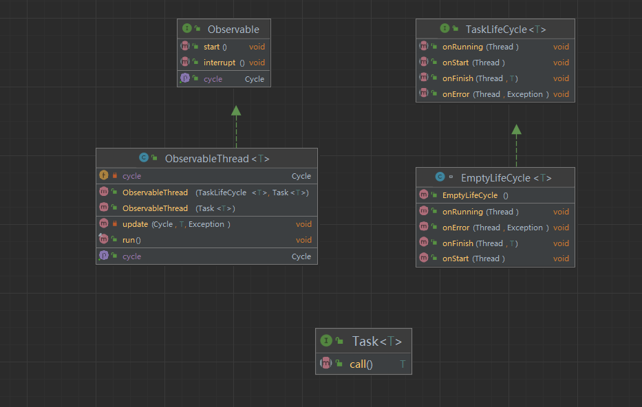

## Java线程监听实现

首先Observable接口规定了线程开始和打断的方法，这两个方法都通过Thread类的start、
interrupt方法实现。
TaskLifCycle接口规定了在线程不同状态下的执行方法
Task 通过 call虚拟方法返回需要监控的线程返回值
EmptyLifCycle作为TaskLifCycle接口的一个虚拟的实现
ObservableThread是一个泛型类其接口返回的是值类型。这个类通过run方法获取到线程的执行状态
之后通过update方法执行相应的监控方法